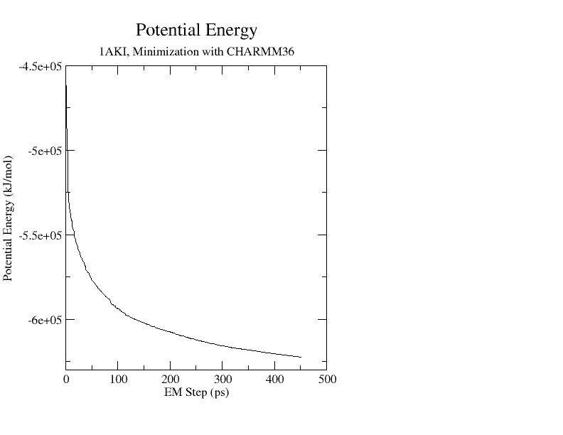
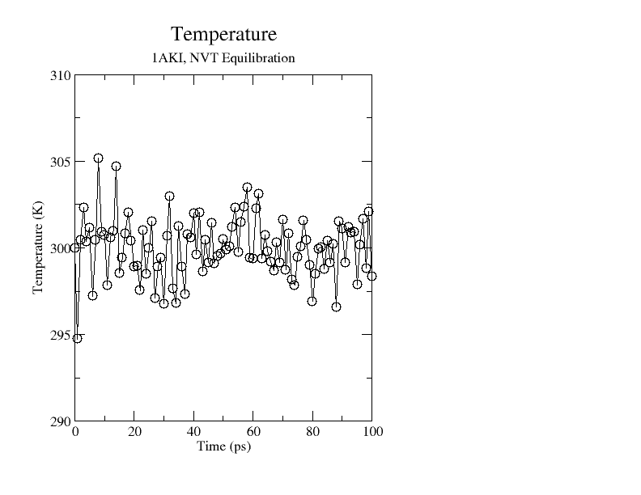
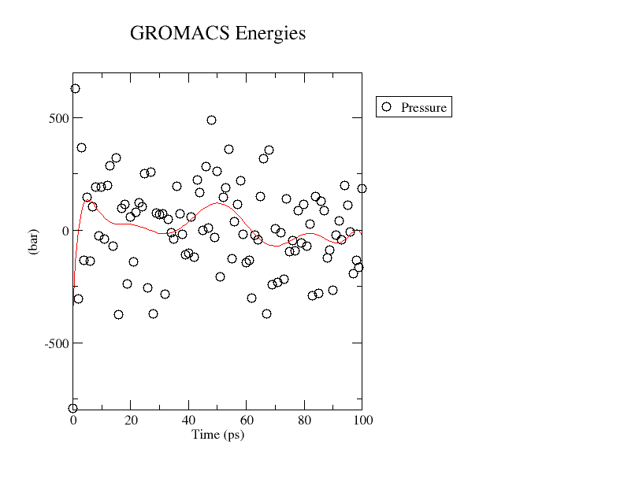
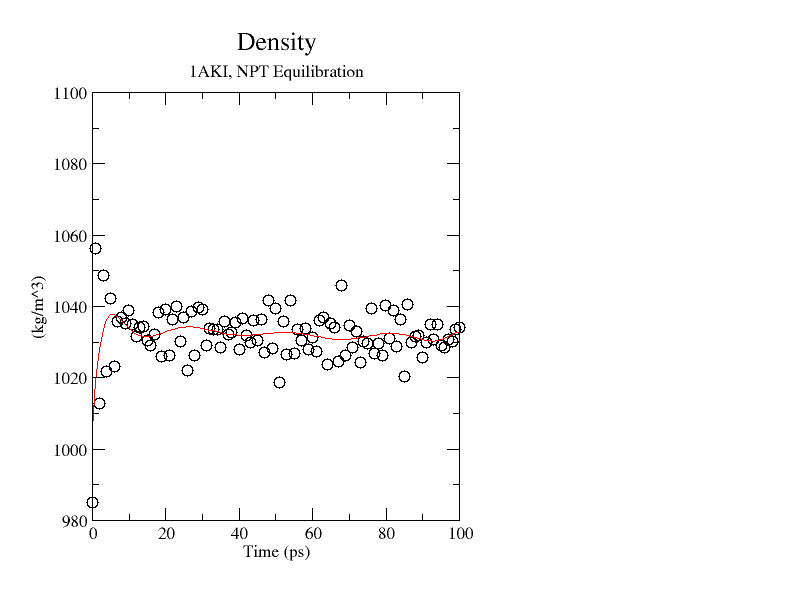
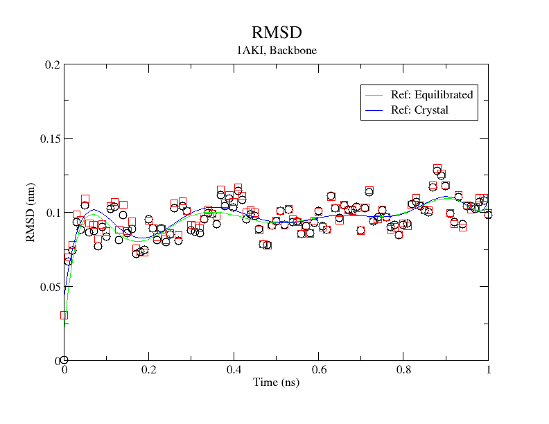

# GROMACS Examples

## Lysozyme in Water example

Ref: http://www.mdtutorials.com/gmx/lysozyme/01_pdb2gmx.html


Start an interactive Slurm job, then change to your GROMACS directory e,g,

```bash
cd /projects/academic/[YourGroupName]/GROMACS
```

This example uses the hen egg white lysozyme - PDB code 1AKI
The PDB text file was downloaded from the [RCSB](http://www.rcsb.org/pdb/home/home.do) website for the crystal
structure.

This was downloaded as follows:

Open a browser window to: https://www.rcsb.org
Use the search bar top left to search for "1AKI"
on the top left hand side of the window [Download Files] [Legacy PDB Format]

Delete the crystal water molecules (residue "HOH" in the PDB file)

```bash
grep -v HOH 1AKI.pdb > 1AKI_clean.pdb
```

Verify thtat there a no entries listed under the comment MISSING
Incomplete internal sequences or any amino acid residues that have missing
atoms will cause pdb2gmx to fail

```bash
grep MISSING 1AKI_clean.pdb
```

No output expected


This example uses the CHARMM36 force field, downloaded from the
[MacKerell lab website](http://mackerell.umaryland.edu/charmm_ff.shtml#gromacs)

```bash
curl -L -o "charmm36-jul2022.ff.tgz" "https://mackerell.umaryland.edu/download.php?filename=CHARMM_ff_params_files/charmm36-jul2022.ff.tgz"
tar xzvf "charmm36-jul2022.ff.tgz"
```

Use "gmx pdb2gmx" to generate three files:

  The topology for the molecule.
  A position restraint file.
  A post-processed structure file.


```bash
gmx pdb2gmx -f 1AKI_clean.pdb -o 1AKI_processed.gro -water tip3p 
```

sample truncated output:

> ```
>                      :-) GROMACS - gmx pdb2gmx, 2025.3 (-:
> 
> Executable:   /usr/local/gromacs/bin/gmx_mpi
> Data prefix:  /usr/local/gromacs
> Working dir:  /projects/academic/[YourGroupName]/GROMACS
> Command line:
>   gmx_mpi pdb2gmx -f 1AKI_clean.pdb -o 1AKI_processed.gro -water tip3p
> 
> Note that more recent versions of the CHARMM force field may be downloaded from
> http://mackerell.umaryland.edu/charmm_ff.shtml#gromacs.
> 
> Select the Force Field:
> 
> From current directory:
> 
>  1: CHARMM all-atom force field
> 
> From '/usr/local/gromacs/share/gromacs/top':
> 
>  2: AMBER03 protein, nucleic AMBER94 (Duan et al., J. Comp. Chem. 24, 1999-2012, 2003)
> 
>  3: AMBER94 force field (Cornell et al., JACS 117, 5179-5197, 1995)
> [...]
> 15: GROMOS96 54a7 force field (Eur. Biophys. J. (2011), 40,, 843-856, DOI: 10.1007/s00249-011-0700-9)
> 
> 16: OPLS-AA/L all-atom force field (2001 aminoacid dihedrals)
> ```

Type "1" then [Enter] to select the "CHARMM all-atom force field" option

```
1
```

Sample truncated output:

> ```
> 
> Using the Charmm36-jul2022 force field in directory ./charmm36-jul2022.ff
> 
> going to rename ./charmm36-jul2022.ff/aminoacids.r2b
> Opening force field file ./charmm36-jul2022.ff/aminoacids.r2b
> [...]
> going to rename ./charmm36-jul2022.ff/solvent.r2b
> Reading 1AKI_clean.pdb...
> WARNING: all CONECT records are ignored
> Read 'LYSOZYME', 1001 atoms
> 
> Analyzing pdb file
> Splitting chemical chains based on TER records or chain id changing.
> 
> There are 1 chains and 0 blocks of water and 129 residues with 1001 atoms
> 
>   chain  #res #atoms
> 
>   1 'A'   129   1001  
> 
> All occupancies are one
> All occupancies are one
> Opening force field file ./charmm36-jul2022.ff/atomtypes.atp
> 
> Reading residue database... (Charmm36-jul2022)
> Opening force field file ./charmm36-jul2022.ff/aminoacids.rtp
> [...]
> Opening force field file ./charmm36-jul2022.ff/solvent.c.tdb
> Analysing hydrogen-bonding network for automated assignment of histidine
>  protonation.
> Processing chain 1 'A' (1001 atoms, 129 residues)
>  213 donors and 184 acceptors were found.
> There are 255 hydrogen bonds
> Will use HISE for residue 15
> 
> Identified residue LYS1 as a starting terminus.
> 
> Identified residue LEU129 as a ending terminus.
> 9 out of 9 lines of specbond.dat converted successfully
> Special Atom Distance matrix:
>                     CYS6   MET12   HIS15   CYS30   CYS64   CYS76   CYS80
>                     SG48    SD87  NE2118   SG238   SG513   SG601   SG630
>    MET12    SD87   1.166
>    HIS15  NE2118   1.776   1.019
>    CYS30   SG238   1.406   1.054   2.069
>    CYS64   SG513   2.835   1.794   1.789   2.241
>    CYS76   SG601   2.704   1.551   1.468   2.116   0.765
>    CYS80   SG630   2.959   1.951   1.916   2.391   0.199   0.944
>    CYS94   SG724   2.550   1.407   1.382   1.975   0.665   0.202   0.855
>   MET105   SD799   1.827   0.911   1.683   0.888   1.849   1.461   2.036
>   CYS115   SG889   1.576   1.084   2.078   0.200   2.111   1.989   2.262
>   CYS127   SG981   0.197   1.072   1.721   1.313   2.799   2.622   2.934
>                    CYS94  MET105  CYS115
>                    SG724   SD799   SG889
>   MET105   SD799   1.381
>   CYS115   SG889   1.853   0.790
>   CYS127   SG981   2.475   1.686   1.483
> Linking CYS-6 SG-48 and CYS-127 SG-981...
> Linking CYS-30 SG-238 and CYS-115 SG-889...
> Linking CYS-64 SG-513 and CYS-80 SG-630...
> Linking CYS-76 SG-601 and CYS-94 SG-724...
> Start terminus LYS-1: NH3+
> End terminus LEU-129: COO-
> Opening force field file ./charmm36-jul2022.ff/aminoacids.arn
> 
> Checking for duplicate atoms....
> 
> Generating any missing hydrogen atoms and/or adding termini.
> 
> Now there are 129 residues with 1960 atoms
> 
> Making bonds...
> 
> Number of bonds was 1984, now 1984
> 
> Generating angles, dihedrals and pairs...
> Before cleaning: 5142 pairs
> Before cleaning: 5187 dihedrals
> 
> Making cmap torsions...
> 
> There are  127 cmap torsion pairs
> 
> There are 5187 dihedrals,  373 impropers, 3547 angles
>           5106 pairs,     1984 bonds and     0 virtual sites
> 
> Total mass 14313.255 a.m.u.
> 
> Total charge 8.000 e
> 
> Writing topology
> 
> Writing coordinate file...
> 
> 		--------- PLEASE NOTE ------------
> 
> You have successfully generated a topology from: 1AKI_clean.pdb.
> 
> The Charmm36-jul2022 force field and the tip3p water model are used.
> [...]
> ```

This generates three files:

```bash
ls -l topol.top posre.itp 1AKI_processed.gro
```

Sample output:


> ```
> -rw-rw-r-- 1 [CCRusername] nogroup  88246 Nov  5 09:54 1AKI_processed.gro
> -rw-rw-r-- 1 [CCRusername] nogroup  31304 Nov  5 09:54 posre.itp
> -rw-rw-r-- 1 [CCRusername] nogroup 541409 Nov  5 09:54 topol.top
> ```

Define the box dimensions using the editconf module.

```bash
gmx editconf -f 1AKI_processed.gro -o 1AKI_newbox.gro -c -d 1.2 -bt cubic
```

sample output:

> ```
>                      :-) GROMACS - gmx editconf, 2025.3 (-:
> 
> Executable:   /usr/local/gromacs/bin/gmx
> Data prefix:  /usr/local/gromacs
> Working dir:  /projects/academic/[YourGroupName]/GROMACS
> Command line:
>   gmx editconf -f 1AKI_processed.gro -o 1AKI_newbox.gro -c -d 1.2 -bt cubic
> 
> Note that major changes are planned in future for editconf, to improve usability and utility.
> Read 1960 atoms
> Volume: 123.376 nm^3, corresponds to roughly 55500 electrons
> No velocities found
>     system size :  3.817  4.234  3.454 (nm)
>     diameter    :  5.010               (nm)
>     center      :  2.781  2.488  0.017 (nm)
>     box vectors :  5.906  6.845  3.052 (nm)
>     box angles  :  90.00  90.00  90.00 (degrees)
>     box volume  : 123.38               (nm^3)
>     shift       :  0.924  1.217  3.688 (nm)
> new center      :  3.705  3.705  3.705 (nm)
> new box vectors :  7.410  7.410  7.410 (nm)
> new box angles  :  90.00  90.00  90.00 (degrees)
> new box volume  : 406.88               (nm^3)
> [...]
> ```

This generates one file

```bash
ls -l 1AKI_newbox.gro
```

sample output:

> ```
> -rw-rw-r-- 1 [CCRusername] nogroup 88246 Nov  5 10:06 1AKI_newbox.gro
> ```

Fill the box with solvent (water) using the solvate module 

```bash
gmx solvate -cp 1AKI_newbox.gro -cs spc216.gro -o 1AKI_solv.gro -p topol.top
```

sample output:

> ```
>                      :-) GROMACS - gmx solvate, 2025.3 (-:
> 
> Executable:   /usr/local/gromacs/bin/gmx
> Data prefix:  /usr/local/gromacs
> Working dir:  /projects/academic/[YourGroupName]/GROMACS
> Command line:
>   gmx solvate -cp 1AKI_newbox.gro -cs spc216.gro -o 1AKI_solv.gro -p topol.top
> 
> Reading solute configuration
> Reading solvent configuration
> 
> Initialising inter-atomic distances...
> 
> WARNING: Masses and atomic (Van der Waals) radii will be guessed
> [...]
> ++++ PLEASE READ AND CITE THE FOLLOWING REFERENCE ++++
> A. Bondi
> van der Waals Volumes and Radii
> J. Phys. Chem. (1964)
> DOI: 10.1021/j100785a001
> -------- -------- --- Thank You --- -------- --------
> 
> Generating solvent configuration
> Will generate new solvent configuration of 4x4x4 boxes
> Solvent box contains 41472 atoms in 13824 residues
> Removed 1848 solvent atoms due to solvent-solvent overlap
> Removed 1833 solvent atoms due to solute-solvent overlap
> Sorting configuration
> Found 1 molecule type:
>     SOL (   3 atoms): 12597 residues
> Generated solvent containing 37791 atoms in 12597 residues
> Writing generated configuration to 1AKI_solv.gro
> 
> Output configuration contains 39751 atoms in 12726 residues
> Volume                 :     406.882 (nm^3)
> Density                :     988.485 (g/l)
> Number of solvent molecules:  12597   
> 
> Processing topology
> Adding line for 12597 solvent molecules with resname (SOL) to topology file (topol.top)
> 
> Back Off! I just backed up topol.top to ./#topol.top.1#
> [...]
> ```

This generates one file, "1AKI_solv.gro" and updates topol.top

```bash
ls -l 1AKI_solv.gro
```

> ```
> -rw-rw-r-- 1 [CCRusername] nogroup 1788841 Nov  5 10:10 1AKI_solv.gro
> ```

```bash
diff topol.top \#topol.top.1# 
```

sample output:

> ```
> < LYSOZYME in water
> ---
> > LYSOZYME
> 18486d18485
> < SOL             12597
> ```

i.e. the "LYSOZYME" linewas changed to "LYSOZYME in water" and the
"SOL [...]" line was added"


Download the example molecular dynamics parameter (.mdp) file from
http://www.mdtutorials.com/

```bash
curl -L -o "ions.mdp" "http://www.mdtutorials.com/gmx/lysozyme/Files/ions.mdp"
```

...and move the file to an "inputs" direcory

```bash
mkdir -p "inputs"
mv ions.mdp ./inputs/
```

Generate an atomic-level input file (.tpr)

```bash
gmx grompp -f inputs/ions.mdp -c 1AKI_solv.gro -p topol.top -o ions.tpr
```

sample output:

> ```
>                       :-) GROMACS - gmx grompp, 2025.3 (-:
> 
> Executable:   /usr/local/gromacs/bin/gmx
> Data prefix:  /usr/local/gromacs
> Working dir:  /projects/academic/[YourGroupName]/GROMACS
> Command line:
>   gmx grompp -f inputs/ions.mdp -c 1AKI_solv.gro -p topol.top -o ions.tpr
> 
> Ignoring obsolete mdp entry 'ns_type'
> 
> NOTE 1 [file inputs/ions.mdp]:
>   With Verlet lists the optimal nstlist is >= 10, with GPUs >= 20. Note
>   that with the Verlet scheme, nstlist has no effect on the accuracy of
>   your simulation.
> 
> Setting the LD random seed to -102887427
> 
> Generated 167799 of the 167910 non-bonded parameter combinations
> Generating 1-4 interactions: fudge = 1
> 
> Generated 117432 of the 167910 1-4 parameter combinations
> 
> Excluding 3 bonded neighbours molecule type 'Protein_chain_A'
> 
> Excluding 2 bonded neighbours molecule type 'SOL'
> 
> NOTE 2 [file topol.top, line 18486]:
>   System has non-zero total charge: 8.000000
>   Total charge should normally be an integer. See
>   https://manual.gromacs.org/current/user-guide/floating-point.html
>   for discussion on how close it should be to an integer.
> 
> 
> 
> Analysing residue names:
> There are:   129    Protein residues
> There are: 12597      Water residues
> Analysing Protein...
> Number of degrees of freedom in T-Coupling group rest is 81459.00
> The integrator does not provide a ensemble temperature, there is no system ensemble temperature
> 
> NOTE 3 [file inputs/ions.mdp]:
>   You are using a plain Coulomb cut-off, which might produce artifacts.
>   You might want to consider using PME electrostatics.
> 
> 
> 
> This run will generate roughly 3 Mb of data
> 
> There were 3 NOTEs
> [...]
> ```

This generates two files:

```bash
ls -l ions.tpr mdout.mdp 
```

sample output:

> ```
> -rw-rw-r-- 1 [CCRusername] nogroup 1173404 Nov  5 12:01 ions.tpr
> -rw-rw-r-- 1 [CCRusername] nogroup   10972 Nov  5 12:01 mdout.mdp
> ```

Replace water molecules with the ions

```bash
gmx genion -s ions.tpr -o 1AKI_solv_ions.gro -p topol.top -pname NA -nname CL -neutral
```

sample abridged output:

```bash
                      :-) GROMACS - gmx genion, 2025.3 (-:

Executable:   /usr/local/gromacs/bin/gmx
Data prefix:  /usr/local/gromacs
Working dir:  /projects/academic/[YourGroupName]/GROMACS
Command line:
  gmx genion -s ions.tpr -o 1AKI_solv_ions.gro -p topol.top -pname NA -nname CL -neutral

Reading file ions.tpr, VERSION 2025.3 (single precision)
Reading file ions.tpr, VERSION 2025.3 (single precision)
Will try to add 0 NA ions and 8 CL ions.
Select a continuous group of solvent molecules
Group     0 (         System) has 39751 elements
Group     1 (        Protein) has  1960 elements
Group     2 (      Protein-H) has  1001 elements
Group     3 (        C-alpha) has   129 elements
Group     4 (       Backbone) has   387 elements
Group     5 (      MainChain) has   515 elements
Group     6 (   MainChain+Cb) has   632 elements
Group     7 (    MainChain+H) has   644 elements
Group     8 (      SideChain) has  1316 elements
Group     9 (    SideChain-H) has   486 elements
Group    10 (    Prot-Masses) has  1960 elements
Group    11 (    non-Protein) has 37791 elements
Group    12 (          Water) has 37791 elements
Group    13 (            SOL) has 37791 elements
Group    14 (      non-Water) has  1960 elements
Select a group: 
```

Select the "SOL" option "13"

at the "Select a group: " prompt

```bash
13
```

sample output:

> ```
> Selected 13: 'SOL'
> Number of (3-atomic) solvent molecules: 12597
> 
> Processing topology
> Replacing 8 solute molecules in topology file (topol.top)  by 0 NA and 8 CL ions.
> 
> Back Off! I just backed up topol.top to ./#topol.top.2#
> Using random seed -209750018.
> Replacing solvent molecule 7036 (atom 23068) with CL
> Replacing solvent molecule 705 (atom 4075) with CL
> Replacing solvent molecule 8703 (atom 28069) with CL
> Replacing solvent molecule 12082 (atom 38206) with CL
> Replacing solvent molecule 4139 (atom 14377) with CL
> Replacing solvent molecule 12230 (atom 38650) with CL
> Replacing solvent molecule 3250 (atom 11710) with CL
> Replacing solvent molecule 10939 (atom 34777) with CL
> [...]
> ```

This generates one file, "1AKI_solv_ions.gro" and updates topol.top

```bash
ls -l 1AKI_solv_ions.gro
```

sample output:

> ```
> -rw-rw-r-- 1 [CCRusername] nogroup 1788130 Nov  5 12:13 1AKI_solv_ions.gro
> ```

```bash
diff topol.top '#topol.top.2#'
```

sample output:


> ```
> < SOL         12589
> < CL               8
> ---
> > SOL             12597
> ```

i.e. 8 water molecules have been replaced by CL ions

Download the input parameter file "minim.mdp"

```bash
curl -L -o "minim.mdp" "http://www.mdtutorials.com/gmx/lysozyme/Files/minim.mdp"
```
...and move the file to the inputs directory

```bash
mv minim.mdp ./inputs/
```

run the energy minimization

```bash
gmx grompp -f inputs/minim.mdp -c 1AKI_solv_ions.gro -p topol.top -o em.tpr
```

sample output

> ```
>                       :-) GROMACS - gmx grompp, 2025.3 (-:
> 
> Executable:   /usr/local/gromacs/bin/gmx
> Data prefix:  /usr/local/gromacs
> Working dir:  /projects/academic/[YourGroupName]/GROMACS
> Command line:
>   gmx grompp -f inputs/minim.mdp -c 1AKI_solv_ions.gro -p topol.top -o em.tpr
> 
> Ignoring obsolete mdp entry 'ns_type'
> 
> NOTE 1 [file inputs/minim.mdp]:
>   With Verlet lists the optimal nstlist is >= 10, with GPUs >= 20. Note
>   that with the Verlet scheme, nstlist has no effect on the accuracy of
>   your simulation.
> 
> Setting the LD random seed to -67666049
> 
> Generated 167799 of the 167910 non-bonded parameter combinations
> Generating 1-4 interactions: fudge = 1
> 
> Generated 117432 of the 167910 1-4 parameter combinations
> 
> Excluding 3 bonded neighbours molecule type 'Protein_chain_A'
> 
> Excluding 2 bonded neighbours molecule type 'SOL'
> 
> Excluding 3 bonded neighbours molecule type 'CL'
> Analysing residue names:
> There are:   129    Protein residues
> There are: 12589      Water residues
> There are:     8        Ion residues
> Analysing Protein...
> Number of degrees of freedom in T-Coupling group rest is 81435.00
> The integrator does not provide a ensemble temperature, there is no system ensemble temperature
> 
> The largest distance between excluded atoms is 0.443 nm between atom 1156 and 1405
> Calculating fourier grid dimensions for X Y Z
> Using a fourier grid of 64x64x64, spacing 0.116 0.116 0.116
> 
> Estimate for the relative computational load of the PME mesh part: 0.32
> 
> This run will generate roughly 3 Mb of data
> 
> There was 1 NOTE
> [...]
> ```

This generates one file, "em.tpr" and updates mdout.mdp

```bash
ls -l em.tpr
```

sample output:

> ```
> -rw-rw-r-- 1 [CCRusername] nogroup 1174552 Nov  6 10:26  em.tpr
> ```

Run the energy minimization

```bash
gmx mdrun -v -deffnm em
```

sample abridged output:

> ```
>                       :-) GROMACS - gmx mdrun, 2025.3 (-:
> 
> Executable:   /usr/local/gromacs/bin/gmx
> Data prefix:  /usr/local/gromacs
> Working dir:  /projects/academic/[YourGroupName]/GROMACS
> Command line:
>   gmx mdrun -v -deffnm em
> 
> Reading file em.tpr, VERSION 2025.3 (single precision)
> Using 40 OpenMP threads 
> 
> 
> Steepest Descents:
>    Tolerance (Fmax)   =  1.00000e+03
>    Number of steps    =        50000
> Step=    0, Dmax= 1.0e-02 nm, Epot= -4.55681e+05 Fmax= 1.81034e+05, atom= 1891
> Step=    1, Dmax= 1.0e-02 nm, Epot= -4.67710e+05 Fmax= 6.69947e+04, atom= 936
> Step=    2, Dmax= 1.2e-02 nm, Epot= -4.81031e+05 Fmax= 2.92839e+04, atom= 19487
> [...]
> Step=  448, Dmax= 1.1e-02 nm, Epot= -6.22184e+05 Fmax= 8.05544e+03, atom= 567
> Step=  449, Dmax= 1.3e-02 nm, Epot= -6.22194e+05 Fmax= 9.69387e+03, atom= 567
> Step=  451, Dmax= 7.8e-03 nm, Epot= -6.22300e+05 Fmax= 9.55374e+02, atom= 567
> 
> writing lowest energy coordinates.
> 
> Steepest Descents converged to Fmax < 1000 in 452 steps
> Potential Energy  = -6.2229994e+05
> Maximum force     =  9.5537390e+02 on atom 567
> Norm of force     =  2.5618381e+01
> [...]
> ```

NOTE:
  The "Potential Energy" E~pot~ should be negative, and (for a simple protein
   in water) on the order of 10^5^-10^6^, depending on the system size and number
   of water molecules.
  The "Maximum force" F~max~ should be no greaterthan the target for which was
   set in minim.mdp - "emtol = 1000.0" in this case, no greater than 1000 kJ mol^-1^ nm^-1^

This generates four files:

```bash
ls -l em.log em.trr em.edr em.gro
```

sample output:

```
-rw-rw-r-- 1 [CCRusername] nogroup   72368 Nov  6 11:00 em.edr
-rw-rw-r-- 1 [CCRusername] nogroup 1788130 Nov  6 11:00 em.gro
-rw-rw-r-- 1 [CCRusername] nogroup  185004 Nov  6 11:00 em.log
-rw-rw-r-- 1 [CCRusername] nogroup  476940 Nov  6 11:00 em.trr
```

Analyze the .edr file "em.edr"

```bash
gmx energy -f em.edr -o potential.xvg
```

sample truncated output:

```
                      :-) GROMACS - gmx energy, 2025.3 (-:

Executable:   /usr/local/gromacs/bin/gmx
Data prefix:  /usr/local/gromacs
Working dir:  /projects/academic/[YourGroupName]/GROMACS
Command line:
  gmx energy -f em.edr -o potential.xvg

Opened em.edr as single precision energy file

Select the terms you want from the following list by
selecting either (part of) the name or the number or a combination.
End your selection with an empty line or a zero.
-------------------------------------------------------------------
  1  Bond             2  U-B              3  Proper-Dih.      4  Improper-Dih.
  5  CMAP-Dih.        6  LJ-14            7  Coulomb-14       8  LJ-(SR)
  9  Coulomb-(SR)    10  Coul.-recip.    11  Potential       12  Pressure
 13  Vir-XX          14  Vir-XY          15  Vir-XZ          16  Vir-YX
[...]
 29  Pres-ZY         30  Pres-ZZ         31  #Surf*SurfTen   32  T-rest

```

Type "11 0" then [Enter] to select Potential (11); zero (0) terminate input

```
11 0
```

sample output:

> ```
> Last energy frame read 357 time  451.000          
> 
> Statistics over 452 steps [ 0.0000 through 451.0000 ps ], 1 data sets
> All statistics are over 358 points (frames)
> 
> Energy                      Average   Err.Est.       RMSD  Tot-Drift
> -------------------------------------------------------------------------------
> Potential                   -601933      10000    24177.7   -67043.2  (kJ/mol)
> [...]
> ```

This generates one file

```bash
ls -l potential.xvg
```

> ```
> -rw-rw-r-- 1 [CCRusername] nogroup 11033 Nov  6 11:21 potential.xvg
> ```

The data in potential.xvg can be plotted, in CCR's [OnDemand portal](https://ondemand.ccr.buffalo.edu) with
[xmgrace](https://plasma-gate.weizmann.ac.il/Grace/doc/UsersGuide.html#s3)

Briefly:

Launch a sesson in CCR's [OnDemand portal](https://ondemand.ccr.buffalo.edu) and connect
to the desktop session
[Applications] {Terminal Emulator]
within the terminal window

Change to your GROMACS directory

```bash
cd /projects/academic/[YourGroupName]/GROMACS
```

Run "xmgrace" with the "potential.xvg" file

```bash
apptainer run \
 -B /projects:/projects,/scratch:/scratch,/util:/util,/vscratch:/vscratch \
 GROMACS-$(arch).sif \
 xmgrace "potential.xvg" \
 -pexec 'title "Potential Energy"; subtitle "1AKI, Minimization with CHARMM36"; legend off; yaxis label "Potential Energy (kJ/mol)"; xaxis label "EM Step (ps)"'
```

This will display a plot that should look like this:  


Which is a little different to the sample output in the tutorial  


Please exit the OnDemand session once you are done:
[Applications] [Log Out] [Log Out]
Then close the browser window


...back on the "salloc" interactive terminal session


Equilibrate the solvent and ions around the protein:
Phase 1 is conducted under an NVT ensemble (constant Number of particles,
Volume, and Temperature.)

Download the .mdp file for this example:

```bash
curl -L -o "nvt.mdp" "http://www.mdtutorials.com/gmx/lysozyme/Files/nvt.mdp"
```

...and move the file to the inputs directory

```bash
mv nvt.mdp ./inputs/
```

```bash
gmx grompp -f inputs/nvt.mdp -c em.gro -r em.gro -p topol.top -o nvt.tpr
```

Sample output:

> ```
>                       :-) GROMACS - gmx grompp, 2025.3 (-:
> 
> Executable:   /usr/local/gromacs/bin/gmx
> Data prefix:  /usr/local/gromacs
> Working dir:  /projects/academic/[YourGroupName]/GROMACS
> Command line:
>   gmx grompp -f inputs/nvt.mdp -c em.gro -r em.gro -p topol.top -o nvt.tpr
> 
> Ignoring obsolete mdp entry 'title'
> Ignoring obsolete mdp entry 'ns_type'
> Setting the LD random seed to -537190402
> 
> Generated 167799 of the 167910 non-bonded parameter combinations
> Generating 1-4 interactions: fudge = 1
> 
> Generated 117432 of the 167910 1-4 parameter combinations
> 
> Excluding 3 bonded neighbours molecule type 'Protein_chain_A'
> 
> turning H bonds into constraints...
> 
> Excluding 2 bonded neighbours molecule type 'SOL'
> 
> turning H bonds into constraints...
> 
> Excluding 3 bonded neighbours molecule type 'CL'
> 
> turning H bonds into constraints...
> 
> Setting gen_seed to -718772497
> 
> Velocities were taken from a Maxwell distribution at 300 K
> Analysing residue names:
> There are:   129    Protein residues
> There are: 12589      Water residues
> There are:     8        Ion residues
> Analysing Protein...
> Number of degrees of freedom in T-Coupling group Protein is 4920.82
> Number of degrees of freedom in T-Coupling group non-Protein is 75555.18
> 
> The largest distance between excluded atoms is 0.440 nm between atom 1156 and 1405
> 
> Determining Verlet buffer for a tolerance of 0.005 kJ/mol/ps at 300 K
> 
> Calculated rlist for 1x1 atom pair-list as 1.035 nm, buffer size 0.035 nm
> 
> Set rlist, assuming 4x4 atom pair-list, to 1.000 nm, buffer size 0.000 nm
> 
> Note that mdrun will redetermine rlist based on the actual pair-list setup
> 
> NOTE 1 [file inputs/nvt.mdp]:
>   Removing center of mass motion in the presence of position restraints
>   might cause artifacts. When you are using position restraints to
>   equilibrate a macro-molecule, the artifacts are usually negligible.
> 
> Calculating fourier grid dimensions for X Y Z
> Using a fourier grid of 48x48x48, spacing 0.154 0.154 0.154
> 
> Estimate for the relative computational load of the PME mesh part: 0.27
> 
> This run will generate roughly 95 Mb of data
> 
> There was 1 NOTE
> [...]
> ```

This generates one file, "nvt.tpr" and updates mdout.mdp

```bash
ls -l nvt.tpr mdout.mdp
```

```
-rw-rw-r-- 1 tkewtest nogroup   11031 Nov  6 14:36 mdout.mdp
-rw-rw-r-- 1 tkewtest nogroup 1798084 Nov  6 14:36 nvt.tpr
```

There are several ways to run the NVT simulation, depending on the resources
requested with the "salloc" command.

Runnin on CPU cores only (no GPUs allocated) on this node in the apptainer
container

This takes a couple of minutes to run on a node with 40 cores allocated:

```bash
gmx mdrun -deffnm nvt
```

sample output:

> ```
>                       :-) GROMACS - gmx mdrun, 2025.3 (-:
> 
> Executable:   /usr/local/gromacs/bin/gmx
> Data prefix:  /usr/local/gromacs
> Working dir:  /projects/academic/[YourGroupName]/GROMACS
> Command line:
>   gmx mdrun -deffnm nvt
> 
> Reading file nvt.tpr, VERSION 2025.3 (single precision)
> Changing nstlist from 10 to 50, rlist from 1 to 1.109
> 
> Using 40 OpenMP threads 
> 
> starting mdrun 'LYSOZYME in water'
> 50000 steps,    100.0 ps.
> 
> Writing final coordinates.
> 
>                Core t (s)   Wall t (s)        (%)
>        Time:     4497.593      112.444     3999.8
>                  (ns/day)    (hour/ns)
> Performance:       76.840        0.312
> ```

However, be aware that this can be run over mutiple nodes &/or can
usilize a GPU if the "gmx" command is replaced with one to use the
extra resources.

Some examples:

Use GPUs on the currecnt node:

```bash
gmx_cuda mdrun -deffnm nvt
```

For multiple node examples, see the Slurm example scripts

This generates five files:

```bash
ls -l nvt.cpt nvt.gro nvt.edr nvt.trr nvt.log
```

Sample output:

```
-rw-rw-r-- 1 [CCRusername] nogroup   955616 Nov  6 17:53 nvt.cpt
-rw-rw-r-- 1 [CCRusername] nogroup    60104 Nov  6 17:53 nvt.edr
-rw-rw-r-- 1 [CCRusername] nogroup  2741770 Nov  6 17:53 nvt.gro
-rw-rw-r-- 1 [CCRusername] nogroup    95213 Nov  6 17:53 nvt.log
-rw-rw-r-- 1 [CCRusername] nogroup 96329760 Nov  6 17:53 nvt.trr
```

Analyze the temperature progression

```bash
gmx energy -f nvt.edr -o temperature.xvg
```

Sample abridged output:

> ```
>                       :-) GROMACS - gmx energy, 2025.3 (-:
> 
> Executable:   /usr/local/gromacs/bin/gmx
> Data prefix:  /usr/local/gromacs
> Working dir:  /projects/academic/[YourGroupName]/GROMACS
> Command line:
>   gmx energy -f nvt.edr -o temperature.xvg
> 
> Opened nvt.edr as single precision energy file
> 
> Select the terms you want from the following list by
> selecting either (part of) the name or the number or a combination.
> End your selection with an empty line or a zero.
> -------------------------------------------------------------------
>   1  Bond             2  U-B              3  Proper-Dih.      4  Improper-Dih. 
>   5  CMAP-Dih.        6  LJ-14            7  Coulomb-14       8  LJ-(SR)       
>   9  Disper.-corr.   10  Coulomb-(SR)    11  Coul.-recip.    12  Position-Rest.
>  13  Potential       14  Kinetic-En.     15  Total-Energy    16  Conserved-En. 
>  17  Temperature     18  Pres.-DC        19  Pressure        20  Constr.-rmsd  
> [...]
>  43  Lamb-non-Protein                  
> 
> ```

Type "17 0" then [Enter] to select the temperature of the system (17); zero (0) terminate input

```
17 0
```

sample output:

> ```
> Last energy frame read 100 time  100.000          
> 
> Statistics over 50001 steps [ 0.0000 through 100.0000 ps ], 1 data sets
> All statistics are over 501 points
> 
> Energy                      Average   Err.Est.       RMSD  Tot-Drift
> -------------------------------------------------------------------------------
> Temperature                 299.812       0.12    3.15203   0.904259  (K)
> [...]
> ```

This generates one file

```bash
ls -l temperature.xvg
```

sample output:

> ```
> -rw-rw-r-- 1 [CCRusername] nogroup 3176 Nov  6 18:02 temperature.xvg
> ```

The data in temperature.xvg  can be plotted, in CCR's [OnDemand portal](https://ondemand.ccr.buffalo.edu) similar
to the above example for potential.xvg

e.g. in an OnDemand terminal window

```bash
apptainer run \
 -B /projects:/projects,/scratch:/scratch,/util:/util,/vscratch:/vscratch \
 GROMACS-$(arch).sif \
 xmgrace "temperature.xvg" \
 -pexec 'title "Temperature"; subtitle "1AKI, NVT Equilibration"; legend off; yaxis label "Temperature (K)"; s0 symbol 1'
```

My test plot looks like this:  


Which is a little different to the sample output in the tutorial  


Equilibrate the solvent and ions around the protein:
Phase 2 - Equilibration of pressure is conducted under an NPT ensemble where
the Number of particles, Pressure, and Temperature are all constant

Download the 500-ps NPT equilibration .mdp file "npt.mdp"

```bash
curl -L -o "npt.mdp" "http://www.mdtutorials.com/gmx/lysozyme/Files/npt.mdp"
```

...and move the file to the inputs directory

```bash
mv npt.mdp ./inputs/
```


```bash
gmx grompp -f inputs/npt.mdp -c nvt.gro -r nvt.gro -t nvt.cpt -p topol.top -o npt.tpr
```

Sample output:

> ```
>                       :-) GROMACS - gmx grompp, 2025.3 (-:
> 
> Executable:   /usr/local/gromacs/bin/gmx
> Data prefix:  /usr/local/gromacs
> Working dir:  /projects/academic/[YourGroupName]/GROMACS
> Command line:
>   gmx grompp -f inputs/npt.mdp -c nvt.gro -r nvt.gro -t nvt.cpt -p topol.top -o npt.tpr
> 
> Ignoring obsolete mdp entry 'title'
> Ignoring obsolete mdp entry 'ns_type'
> Setting the LD random seed to 1694439166
> 
> Generated 167799 of the 167910 non-bonded parameter combinations
> Generating 1-4 interactions: fudge = 1
> 
> Generated 117432 of the 167910 1-4 parameter combinations
> 
> Excluding 3 bonded neighbours molecule type 'Protein_chain_A'
> 
> turning H bonds into constraints...
> 
> Excluding 2 bonded neighbours molecule type 'SOL'
> 
> turning H bonds into constraints...
> 
> Excluding 3 bonded neighbours molecule type 'CL'
> 
> turning H bonds into constraints...
> 
> Taking velocities from 'nvt.gro'
> 
> NOTE 1 [file topol.top, line 18487]:
>   You are combining position restraints with Parrinello-Rahman pressure
>   coupling, which can lead to instabilities. If you really want to combine
>   position restraints with pressure coupling, we suggest to use C-rescale
>   pressure coupling instead.
> 
> Analysing residue names:
> There are:   129    Protein residues
> There are: 12589      Water residues
> There are:     8        Ion residues
> Analysing Protein...
> Number of degrees of freedom in T-Coupling group Protein is 4920.82
> Number of degrees of freedom in T-Coupling group non-Protein is 75555.18
> 
> The largest distance between excluded atoms is 0.446 nm between atom 1156 and 1405
> 
> Determining Verlet buffer for a tolerance of 0.005 kJ/mol/ps at 300 K
> 
> Calculated rlist for 1x1 atom pair-list as 1.035 nm, buffer size 0.035 nm
> 
> Set rlist, assuming 4x4 atom pair-list, to 1.000 nm, buffer size 0.000 nm
> 
> Note that mdrun will redetermine rlist based on the actual pair-list setup
> 
>   rest:       	 3.689  3.718  3.705
>   rest:       	 3.689  3.718  3.705
> 
> NOTE 2 [file inputs/npt.mdp]:
>   Removing center of mass motion in the presence of position restraints
>   might cause artifacts. When you are using position restraints to
>   equilibrate a macro-molecule, the artifacts are usually negligible.
> 
> 
> Reading Coordinates, Velocities and Box size from old trajectory
> 
> Will read whole trajectory
> Last frame         -1 time  100.000   
> 
> Using frame at t = 100 ps
> 
> Starting time for run is 0 ps
> Calculating fourier grid dimensions for X Y Z
> Using a fourier grid of 48x48x48, spacing 0.154 0.154 0.154
> 
> Estimate for the relative computational load of the PME mesh part: 0.27
> 
> This run will generate roughly 95 Mb of data
> 
> There were 2 NOTEs
> [...]
> ```

This generates one file, "npt.tpr" and updates mdout.mdp

```bash
ls -l npt.tpr mdout.mdp
```

Sample output:

> ```
> -rw-rw-r-- 1 [CCRusername] nogroup   11071 Nov  6 18:15 mdout.mdp
> -rw-rw-r-- 1 [CCRusername] nogroup 1798108 Nov  6 18:15 npt.tpr
> ```

Run he NPT simulation

This takes a couple of minutes to run on a node with 40 cores allocated:


```bash
gmx mdrun -deffnm npt
```

sample output:

> ```
>                       :-) GROMACS - gmx mdrun, 2025.3 (-:
> 
> Executable:   /usr/local/gromacs/bin/gmx
> Data prefix:  /usr/local/gromacs
> Working dir:  /projects/academic/[YourGroupName]/GROMACS
> Command line:
>   gmx mdrun -deffnm npt
> 
> Reading file npt.tpr, VERSION 2025.3 (single precision)
> Changing nstlist from 10 to 50, rlist from 1 to 1.109
> 
> Using 40 OpenMP threads 
> 
> starting mdrun 'LYSOZYME in water'
> 50000 steps,    100.0 ps.
> 
> Writing final coordinates.
> 
>                Core t (s)   Wall t (s)        (%)
>        Time:     4621.352      115.544     3999.7
>                  (ns/day)    (hour/ns)
> Performance:       74.778        0.321
> [...]
> ```

Analyze the pressure progression

```bash
gmx energy -f npt.edr -o pressure.xvg
```

Sample abridged output:

> ```
>                       :-) GROMACS - gmx energy, 2025.3 (-:
> 
> Executable:   /usr/local/gromacs/bin/gmx
> Data prefix:  /usr/local/gromacs
> Working dir:  /projects/academic/[YourGroupName]/GROMACS
> Command line:
>   gmx energy -f npt.edr -o pressure.xvg
> 
> Opened npt.edr as single precision energy file
> 
> Select the terms you want from the following list by
> selecting either (part of) the name or the number or a combination.
> End your selection with an empty line or a zero.
> -------------------------------------------------------------------
>   1  Bond             2  U-B              3  Proper-Dih.      4  Improper-Dih. 
>   5  CMAP-Dih.        6  LJ-14            7  Coulomb-14       8  LJ-(SR)       
>   9  Disper.-corr.   10  Coulomb-(SR)    11  Coul.-recip.    12  Position-Rest.
>  13  Potential       14  Kinetic-En.     15  Total-Energy    16  Conserved-En. 
>  17  Temperature     18  Pres.-DC        19  Pressure        20  Constr.-rmsd  
>  21  Box-X           22  Box-Y           23  Box-Z           24  Volume
> [...]
>  49  Box-Vel-ZZ      50  T-Protein       51  T-non-Protein   52  Lamb-Protein  
>  53  Lamb-non-Protein                  
> 
> ```


Type "19 0" then [Enter] to select the pressure of the system (19); zero (0) terminate input

```
19 0
```

sample output:

> ```
> Last energy frame read 100 time  100.000          
> 
> Statistics over 50001 steps [ 0.0000 through 100.0000 ps ], 1 data sets
> All statistics are over 501 points
> 
> Energy                      Average   Err.Est.       RMSD  Tot-Drift
> -------------------------------------------------------------------------------
> Pressure                   -1.63286        3.7    176.657    19.8596  (bar)
> [...]
> ```

This generates one file

```bash
ls -l pressure.xvg
```

sample output:

> ```
> -rw-rw-r-- 1 [CCRusername] nogroup 3175 Nov  7 14:10 pressure.xvg
> ```

The data in pressure.xvg  can be plotted, in CCR's [OnDemand portal](https://ondemand.ccr.buffalo.edu) with
"xmgrace"

e.g. in an OnDemand terminal window

```bash
apptainer run \
 -B /projects:/projects,/scratch:/scratch,/util:/util,/vscratch:/vscratch \
 GROMACS-$(arch).sif \
 xmgrace "pressure.xvg" \
 -pexec 'title "Pressure"; subtitle "1AKI, NPT Equilibration"; legend off; yaxis label "Pressure (bar)"; s0 line type 0; s0 symbol 1'
```

Add a 10th degree regression line with:

[Data] [Transformations] [Regresssion...]  
Type of Fit: [10th Degree]  
[Accept]  
close the "Grace: Console" window and the "Regression" window  


My test plot looks like this:  


Which is a little different to the sample output in the tutorial  


...back on the "salloc" interactive terminal session

Examine the density using energy 

```bash
gmx energy -f npt.edr -o density.xvg
```

Sample abridged output:

> ```
>                       :-) GROMACS - gmx energy, 2025.3 (-:
> 
> Executable:   /usr/local/gromacs/bin/gmx
> Data prefix:  /usr/local/gromacs
> Working dir:  /projects/academic/[YourGroupName]/GROMACS
> Command line:
>   gmx energy -f npt.edr -o density.xvg
> 
> Opened npt.edr as single precision energy file
> 
> Select the terms you want from the following list by
> selecting either (part of) the name or the number or a combination.
> End your selection with an empty line or a zero.
> -------------------------------------------------------------------
>   1  Bond             2  U-B              3  Proper-Dih.      4  Improper-Dih. 
>   5  CMAP-Dih.        6  LJ-14            7  Coulomb-14       8  LJ-(SR)       
>   9  Disper.-corr.   10  Coulomb-(SR)    11  Coul.-recip.    12  Position-Rest.
>  13  Potential       14  Kinetic-En.     15  Total-Energy    16  Conserved-En. 
>  17  Temperature     18  Pres.-DC        19  Pressure        20  Constr.-rmsd  
>  21  Box-X           22  Box-Y           23  Box-Z           24  Volume        
>  25  Density         26  pV              27  Enthalpy        28  Vir-XX        
> [...]
>  49  Box-Vel-ZZ      50  T-Protein       51  T-non-Protein   52  Lamb-Protein  
>  53  Lamb-non-Protein                  
> 
> ```


Type "25 0" then [Enter] to select the density of the system (25); zero (0) terminate input

```
25 0
```

sample output:

> ```
> Last energy frame read 100 time  100.000          
> 
> Statistics over 50001 steps [ 0.0000 through 100.0000 ps ], 1 data sets
> All statistics are over 501 points
> 
> Energy                      Average   Err.Est.       RMSD  Tot-Drift
> -------------------------------------------------------------------------------
> Density                     1032.07       0.23    6.16167  -0.847232  (kg/m^3)
> [...]
> ```

This generates one file

```bash
ls -l density.xvg
```

sample output:

> ```
> -rw-rw-r-- 1 [CCRusername] nogroup 3278 Nov 11 09:57 density.xvg
> ```

The data in density.xvg can be plotted, in CCR's [OnDemand portal](https://ondemand.ccr.buffalo.edu) with
"xmgrace"

e.g. in an OnDemand terminal window

```bash
apptainer run \
 -B /projects:/projects,/scratch:/scratch,/util:/util,/vscratch:/vscratch \
 GROMACS-$(arch).sif \
 xmgrace "density.xvg" \
 -pexec 'title "Density"; subtitle "1AKI, NPT Equilibration"; legend off; s0 line type 0; s0 symbol 1'
```

Add a 10th degree regression line with:

[Data] [Transformations] [Regresssion...]  
Type of Fit: [10th Degree]  
[Accept]  
close the "Grace: Console" window and the "Regression" window  

My test plot looks like this:  


Which is a little different to the sample output in the tutorial


Now the system is equilibrated, release the position restraints and run
production MD for data collection

Download the 10-ns MD simulation file (md.mdp) file from
http://www.mdtutorials.com/

```bash
curl -L -o "md.mdp" "http://www.mdtutorials.com/gmx/lysozyme/Files/md.mdp"
```

...and move the file to an "inputs" direcory

```bash
mv md.mdp ./inputs/
```

Generate the .tpr file for this simulation:

```bash
gmx grompp -f inputs/md.mdp -c npt.gro -t npt.cpt -p topol.top -o md_0_10.tpr
```

Sample output:

> ```
>                       :-) GROMACS - gmx grompp, 2025.3 (-:
> 
> Executable:   /usr/local/gromacs/bin/gmx
> Data prefix:  /usr/local/gromacs
> Working dir:  /projects/academic/[YourGroupName]/GROMACS
> Command line:
>   gmx grompp -f inputs/md.mdp -c npt.gro -t npt.cpt -p topol.top -o md_0_10.tpr
> 
> Ignoring obsolete mdp entry 'title'
> Ignoring obsolete mdp entry 'ns_type'
> Setting the LD random seed to -593003529
> 
> Generated 167799 of the 167910 non-bonded parameter combinations
> Generating 1-4 interactions: fudge = 1
> 
> Generated 117432 of the 167910 1-4 parameter combinations
> 
> Excluding 3 bonded neighbours molecule type 'Protein_chain_A'
> 
> turning H bonds into constraints...
> 
> Excluding 2 bonded neighbours molecule type 'SOL'
> 
> turning H bonds into constraints...
> 
> Excluding 3 bonded neighbours molecule type 'CL'
> 
> turning H bonds into constraints...
> 
> Taking velocities from 'npt.gro'
> Analysing residue names:
> There are:   129    Protein residues
> There are: 12589      Water residues
> There are:     8        Ion residues
> Analysing Protein...
> Number of degrees of freedom in T-Coupling group Protein is 4920.82
> Number of degrees of freedom in T-Coupling group non-Protein is 75555.18
> 
> The largest distance between excluded atoms is 0.448 nm between atom 1156 and 1405
> 
> Determining Verlet buffer for a tolerance of 0.005 kJ/mol/ps at 300 K
> 
> Calculated rlist for 1x1 atom pair-list as 1.035 nm, buffer size 0.035 nm
> 
> Set rlist, assuming 4x4 atom pair-list, to 1.000 nm, buffer size 0.000 nm
> 
> Note that mdrun will redetermine rlist based on the actual pair-list setup
> 
> Reading Coordinates, Velocities and Box size from old trajectory
> 
> Will read whole trajectory
> Last frame         -1 time  100.000   
> 
> Using frame at t = 100 ps
> 
> Starting time for run is 0 ps
> Calculating fourier grid dimensions for X Y Z
> Using a fourier grid of 48x48x48, spacing 0.152 0.152 0.152
> 
> Estimate for the relative computational load of the PME mesh part: 0.27
> 
> This run will generate roughly 23 Mb of data
> [...]
> ```


This generates one file, "md_0_10.tpr" and updates mdout.mdp

```bash
ls -l md_0_10.tpr
```

sample output:

> ```
> -rw-rw-r-- 1 [CCRusername] nogroup 1690984 Nov 11 14:42 md_0_10.tpr
> ```

Run the 10-ns MD simulation:
This takes about 20 minutes to run on a node with 40 cores allocated:

```bash
gmx mdrun -deffnm md_0_10
```

Sample output:

> ```
>                       :-) GROMACS - gmx mdrun, 2025.3 (-:
> 
> Executable:   /usr/local/gromacs/bin/gmx
> Data prefix:  /usr/local/gromacs
> Working dir:  /projects/academic/[YourGroupName]/GROMACS
> Command line:
>   gmx mdrun -deffnm md_0_10
> 
> Reading file md_0_10.tpr, VERSION 2025.3 (single precision)
> Changing nstlist from 10 to 50, rlist from 1 to 1.111
> 
> Using 40 OpenMP threads 
> 
> starting mdrun 'LYSOZYME in water'
> 500000 steps,   1000.0 ps.
> 
> Writing final coordinates.
> 
>                Core t (s)   Wall t (s)        (%)
>                Core t (s)   Wall t (s)        (%)
>        Time:    46079.940     1152.002     4000.0
>                  (ns/day)    (hour/ns)
> Performance:       75.000        0.320
> [...]
> ```

This generates six files:

```bash
ls -l md_0_10.log md_0_10.xtc md_0_10.edr md_0_10.gro md_0_10_prev.cpt md_0_10.cpt
```

sample output:

> ```
> -rw-rw-r-- 1 [CCRusername] nogroup   955976 Nov 11 15:40 md_0_10.cpt
> -rw-rw-r-- 1 [CCRusername] nogroup    71140 Nov 11 15:40 md_0_10.edr
> -rw-rw-r-- 1 [CCRusername] nogroup  2741770 Nov 11 15:40 md_0_10.gro
> -rw-rw-r-- 1 [CCRusername] nogroup    92686 Nov 11 15:40 md_0_10.log
> -rw-rw-r-- 1 [CCRusername] nogroup   955976 Nov 11 15:40 md_0_10_prev.cpt
> -rw-rw-r-- 1 [CCRusername] nogroup 14426728 Nov 11 15:40 md_0_10.xtc
> ```


Correcting for Periodicity Effects
Reimage the trajectory


```bash
gmx trjconv -s md_0_10.tpr -f md_0_10.xtc -o md_0_10_noPBC.xtc -pbc mol -center
```

Sample abridged output:

> ```
>                      :-) GROMACS - gmx trjconv, 2025.3 (-:
> 
> Executable:   /usr/local/gromacs/bin/gmx
> Data prefix:  /usr/local/gromacs
> Working dir:  /projects/academic/[YourGroupName]/GROMACS
> Command line:
>   gmx trjconv -s md_0_10.tpr -f md_0_10.xtc -o md_0_10_noPBC.xtc -pbc mol -center
> 
> Note that major changes are planned in future for trjconv, to improve usability and utility.
> Will write xtc: Compressed trajectory (portable xdr format): xtc
> Reading file md_0_10.tpr, VERSION 2025.3 (single precision)
> Reading file md_0_10.tpr, VERSION 2025.3 (single precision)
> Select group for centering
> Group     0 (         System) has 39735 elements
> Group     1 (        Protein) has  1960 elements
> Group     2 (      Protein-H) has  1001 elements
> [...]
> Group    15 (            Ion) has     8 elements
> Group    16 ( Water_and_ions) has 37775 elements
> Select a group: 
> ```

Type "1" then [Enter] to select "Protein" at the "Select a group:" prompt

```
1
```

Sample abridged output:

> ```
> Selected 1: 'Protein'
> Select group for output
> Group     0 (         System) has 39735 elements
> Group     1 (        Protein) has  1960 elements
> Group     2 (      Protein-H) has  1001 elements
> [...]
> Group    15 (            Ion) has     8 elements
> Group    16 ( Water_and_ions) has 37775 elements
> Select a group: 
> ```

Type "0" then [Enter] to select "System" for the output at the
"Select a group:" prompt


```
0
```

Sample output:

> ```
> Selected 0: 'System'
> Reading frame       0 time    0.000   
> Precision of md_0_10.xtc is 0.001 (nm)
> Using output precision of 0.001 (nm)
> Last frame        100 time 1000.000    ->  frame     99 time  990.000      
>  ->  frame    100 time 1000.000      
> Last written: frame    100 time 1000.000
> [...]
> ```

This generates one file

```bash
ls -l md_0_10_noPBC.xtc
```

sample output:

> ```
> -rw-rw-r-- 1 [CCRusername] nogroup 14426744 Nov 11 16:16 md_0_10_noPBC.xtc
> ```


Root-Mean-Square Deviation

```bash
gmx rms -s md_0_10.tpr -f md_0_10_noPBC.xtc -o rmsd.xvg -tu ns
```


Sample abriged output:

> ```
>                        :-) GROMACS - gmx rms, 2025.3 (-:
> 
> Executable:   /usr/local/gromacs/bin/gmx
> Data prefix:  /usr/local/gromacs
> Working dir:  /projects/academic/[YourGroupName]/GROMACS
> Command line:
>   gmx rms -s md_0_10.tpr -f md_0_10_noPBC.xtc -o rmsd.xvg -tu ns
> 
> Reading file md_0_10.tpr, VERSION 2025.3 (single precision)
> Reading file md_0_10.tpr, VERSION 2025.3 (single precision)
> Select group for least squares fit
> Group     0 (         System) has 39735 elements
> Group     1 (        Protein) has  1960 elements
> Group     2 (      Protein-H) has  1001 elements
> Group     3 (        C-alpha) has   129 elements
> Group     4 (       Backbone) has   387 elements
> Group     5 (      MainChain) has   515 elements
> [...]
> Group    15 (            Ion) has     8 elements
> Group    16 ( Water_and_ions) has 37775 elements
> Select a group: 
> ```


Type "4" then [Enter] to select "Backbone" for the least-squares fit at the
"Select a group:" prompt

```
4
```

Sample abriged output:

> ```
> Selected 4: 'Backbone'
> Select group for RMSD calculation
> Group     0 (         System) has 39735 elements
> Group     1 (        Protein) has  1960 elements
> Group     2 (      Protein-H) has  1001 elements
> Group     3 (        C-alpha) has   129 elements
> Group     4 (       Backbone) has   387 elements
> Group     5 (      MainChain) has   515 elements
> [...]
> Group    15 (            Ion) has     8 elements
> Group    16 ( Water_and_ions) has 37775 elements
> Select a group: 
> ```

Type "4" then [Enter] to select "Backbone" for the group for RMSD calculation
"Select a group:" prompt

```
4
```

Sample output:

> ```
> Selected 4: 'Backbone'
> Last frame        100 time    1.000
> [...]
> ```

This generates one file

```bash
ls -l rmsd.xvg
```

sample output:

> ```
> -rw-rw-r-- 1 [CCRusername] nogroup 3207 Nov 11 16:35 rmsd.xvg
> ```

The data in this .xvg file, and the one that follows, can be can be plotted,
in CCR's [OnDemand portal](https://ondemand.ccr.buffalo.edu) with "xmgrace"


Calculate RMSD relative to the crystal structure

```bash
gmx rms -s em.tpr -f md_0_10_noPBC.xtc -o rmsd_xtal.xvg -tu ns
```

Sample abridged output:

> ```
> [...]
> Reading file em.tpr, VERSION 2025.3 (single precision)
> Reading file em.tpr, VERSION 2025.3 (single precision)
> Select group for least squares fit
> Group     0 (         System) has 39735 elements
> Group     1 (        Protein) has  1960 elements
> Group     2 (      Protein-H) has  1001 elements
> Group     3 (        C-alpha) has   129 elements
> Group     4 (       Backbone) has   387 elements
> Group     5 (      MainChain) has   515 elements
> [...]
> Group    16 ( Water_and_ions) has 37775 elements
> Select a group: 
> ```

Type "4" then [Enter] to select "Backbone" for the least-squares fit at the
"Select a group:" prompt

```
4
```

Sample abriged output:

> ```
> Selected 4: 'Backbone'
> Select group for RMSD calculation
> Group     0 (         System) has 39735 elements
> Group     1 (        Protein) has  1960 elements
> Group     2 (      Protein-H) has  1001 elements
> Group     3 (        C-alpha) has   129 elements
> Group     4 (       Backbone) has   387 elements
> Group     5 (      MainChain) has   515 elements
> [...]
> Group    16 ( Water_and_ions) has 37775 elements
> Select a group: 
> ```

Type "4" then [Enter] to select "Backbone" for the group for RMSD calculation
"Select a group:" prompt

```
4
```

Sample output:

> ```
> Selected 4: 'Backbone'
> Last frame        100 time    1.000
> [...]
> ```

This generates one file

```bash
ls -l rmsd_xtal.xvg
```

sample output:

> ```
> -rw-rw-r-- 1 [CCRusername] nogroup 3197 Nov 11 16:52 rmsd_xtal.xvg
> ```


The data in this .xvg file, and the prior one (rmsd.xvg), can be can be
plotted, in CCR's [OnDemand portal](https://ondemand.ccr.buffalo.edu) with "xmgrace"

e.g. in an OnDemand terminal window

```bash
apptainer run \
 -B /projects:/projects,/scratch:/scratch,/util:/util,/vscratch:/vscratch \
 GROMACS-$(arch).sif \
 xmgrace "rmsd.xvg" "rmsd_xtal.xvg" \
 -pexec 'title "RMSD"; subtitle "1AKI, Backbone"; legend on; s0 line type 0; s0 symbol 1; s1 line type 0; s1 symbol 2'
```
Add a 10th degree regression line with:

[Data] [Transformations] [Regresssion...]  
click on "All sets"  
Type of Fit: [10th Degree]  
[Accept]  
close the "Grace: Console" window and the "Regression" window  

Label the two regressions:

[Plot] [Set Apprearance]  
select "G0.S2[2][101]"  
Legend Sring: "Ref: Equilibrated"  
[Apply]  
select "G0.S3[2][101]"  
Legend Sring: "Ref: Crystal"  
[Accept]  

My test plot looks like this:  


Which is a little different to the sample output in the tutorial


